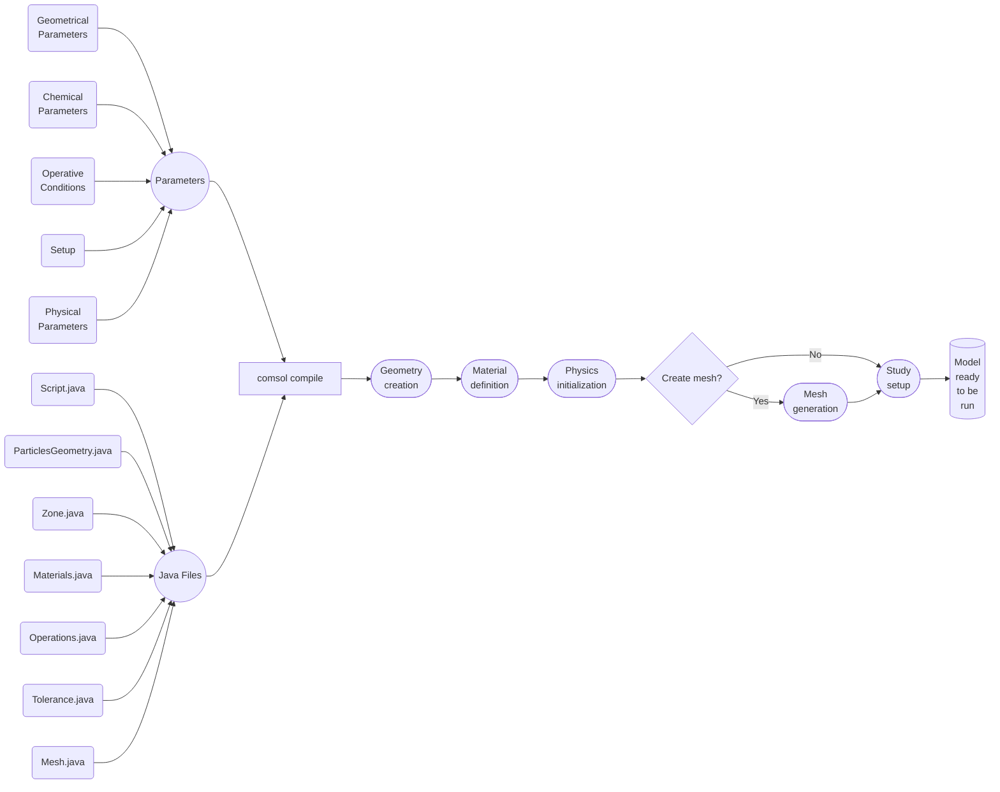

# battery_porescale
Repository for simulation templates regarding electrode-scale modelling of batteries.

## Comsol Battery Half Cell - SEI

### Work Flow


### Instuctions:

To create the half cell battery model you need the software Comsol Multiphysics 6.4. This code has been tested for this specific version, therefore it can not be guaranteed to work for others versions, whether newer or older.
First of all, it is necessary that the folder \Parameters contains all the necessary input file in a .txt format. Moreover, each file must have some specific features:
- geometry.txt : this file contains the geometrical and spatial characterization of each particle. The file is formed by four columns separated by spaces (' '). The first column is a capital letter followed by a closed round bracket and the letter can have three different values: D)=Dimension; P)=Position; R)=Rotation. The others three columns contains float numbers and each of them represent a dimension, a position or a rotation along an axes, in order, X, Y and, Z. The number of lines that start with "D)" must be equal either to the number of lines that start with "P)" or "R)" and this will correspond to the total number of particles genereted in the system.
- C20.txt : this is a double column file of float numbers. The first column represent the State of Charge, so it must be 0<SoC<1. The second column is the experimental equilibrium potential of the electrod under consideration as function of the SoC.
- D.txt : this file has a formatting similar to the C20.txt, but it contains the solid diffusion coefficient as a function of the SoC.
- D_L.txt : this is a double column file of float numbers. The first column represent the Lithium concentration within the electrolyte, the second column is the liquid diffusion coefficient as function of the concentration in [mol/m^3].
- sigma_L.txt : this file has a formatting similar to the D_L.txt, but it contains the liquid electrical conductivity as a function of the concentration in [mol/m^3].
- geometric_details.txt : this file is divided by three columns, separated by spaces (' '). The first is the variable name, the second is the variable value with the corresponding unit of measure enclosed in square brackets and, the last column is the variable description, enclosed by double quotation marks (" "). This file contains the geometrical parameters of the electrode, such as height, width, depth and, separator thikness.
- operative_conditions.txt : this file has a formatting similar to the geometrical_details.txt but it contains the operative conditions to run the simulation, such as, for example, the discharge current.
- chemico_physical_parameters.txt : this file has a formatting similar to the previous two and it contains all the chemical-physical constants necessary to run the simulation.
- SEI.txt : this file contains all the paramters needed to describe the SEI layer, such as it density, molar mass, stoichiometric coefficient etc. The format is the same of the previous one.
- setup.txt : this last file contains some impostation needed by the script, such as tollerance values or the simulation time step. From this file you can also decide whether to have the code automatically generate the mesh ("Automatic == yes"), and with what level of refinement (e.g. "Refinement level (1=Extremely fine; 9=Extremely coarse) == 4").
- Variabiles.txt : This file contains user-defined variables and derived expressions. Some entries act purely as aliases (e.g., LSEI), providing short and readable names for existing COMSOL variables or fields, while others define new physical quantities through algebraic combinations of model parameters and solution fields. For instance, j_SEI represents the kinetic expression of the reduction side reaction driving SEI layer growth and is formulated as a function of LSEI together with other model variables.
### Running:

To build the model is necessary to open a terminal in the working directory that contains all the .java files and the "Parameters" folder and run the following command:
```bash
[...]\comsol61\multiphysics\bin\comsol compile *.java
```
Where [...] is the COMSOL installation path.  
In this way, the .class binary files will be generated. 

Once the .class files are generated, the user can choose to proceed either in a semi-automatic either automatic way.

#### Semi-Automatic Opption
Run from the same directory the following command:

```bash
[...]\comsol64\multiphysics\bin\comsol
```
This command will open COMSOL Multiphysics 6.4 in the working directory. Now you need to "Open" the Script.class file from COMSOL and this will generate your model.

#### Automatic Option
If you prefer to proceed fully automatically, it is possible to bypass the comsol graphical interface and directly generate and run the simulation with the following commands:

```bash
[...]\comsol64\multiphysics\bin\comsol batch -inputfile Script.class
```

```bash
[...]\comsol64\multiphysics\bin\comsol batch -inputfile Script_Model.mph
```

### Notes:
1) Opening COMSOL in a way other than explained may cause errors in reading parameters.
2) The code has a feature that will try to generate a mesh for the model. Since automatic mesh generation can generate errors or meshes that are too dense, increasing the computational cost, it is suggested to check that the result of this operation meets the user's requirements. If these are not met, it is necessary to proceed with mesh generation via GUI, editing the "setup.txt" file ("Automatic == no")

