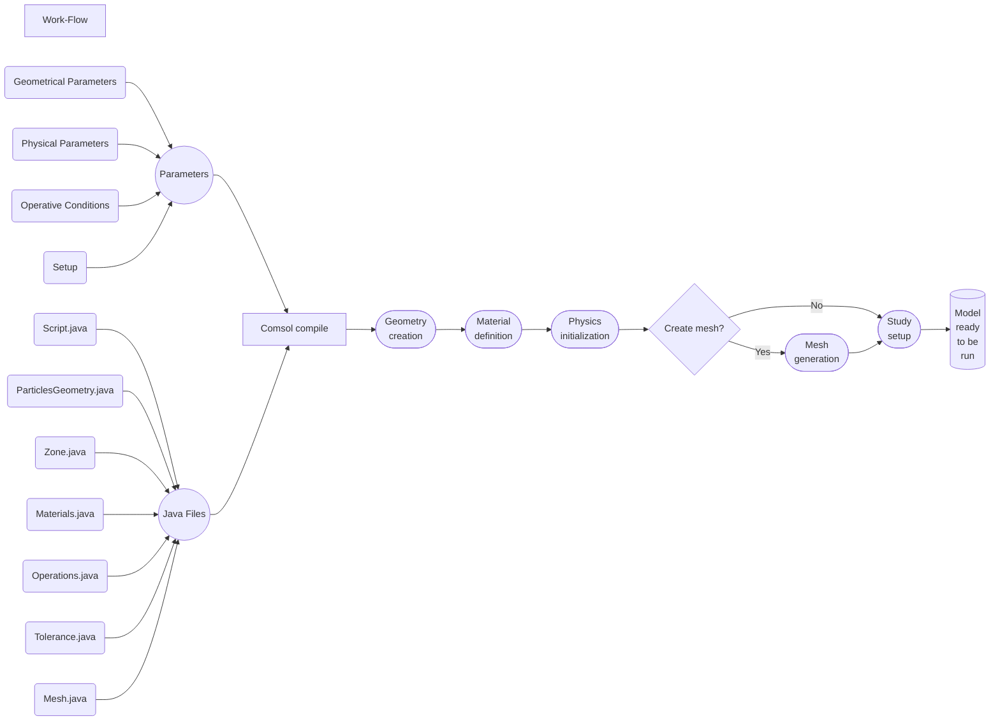

# battery_continuum_modelling
Repository for simulation templates regarding continuum modelling of batteries.

## Comsol Battery Half Cell

### Work Flow

### Running
Instuctions:

To create the half cell battery model you need the software Comsol Multiphysics 6.1. This code has been tested for this specific version, therefore it can not be guaranteed to work for others versions, whether newer or older.
First of all, it is necessary that the folder \Parameters contains all the necessary input file in a .txt format. Moreover, each file must have some specific features:
- geometry.txt : this file contains the geometrical and spatial characterization of each particle. The file is formed by four columns separted by spaces (' '). The first column is a capital letter followed by a closed round bracket and the letter can have three different values: D)=Dimension; P)=Position; R)=Rotation. The others three columns contains float numbers and 
