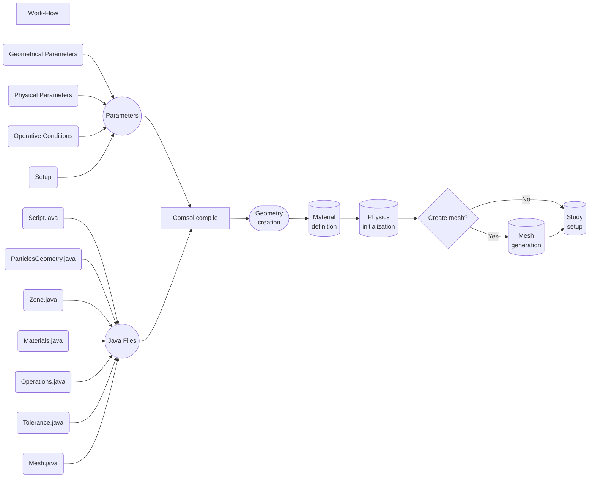

# battery_continuum_modelling
Repository for simulation templates regarding continuum modelling of batteries.

## Comsol Battery Half Cell

### Work Flow

```mermaid
graph LR
TOP[Work-Flow]
  IN1(Geometrical Parameters)-->O1((Parameters))
  IN2(Physical Parameters)-->O1
  IN3(Operative Conditions)-->O1
  IN4(Setup)-->O1
  IN5(Script.java)-->O2((Java Files))
  IN6(ParticlesGeometry.java)-->O2
  IN7(Zone.java)-->O2
  IN8(Materials.java)-->O2
  IN9(Operations.java)-->O2
  IN10(Tolerance.java)-->O2
  IN11(Mesh.java)-->O2
  O1-->BLK1[Comsol compile]
  O2-->BLK1
  BLK1-->PK1([Geometry <br> creation])
  PK1-->PK2[(Material <br> definition)]
  PK2-->PK3[(Physics <br> initialization)]
  PK3-->PK4{Create mesh?}
  PK4-->|Yes|PK5[(Mesh <br> generation)]
  PK4-->|No|PK6[(Study <br> setup)]
  PK5-->PK6
```
